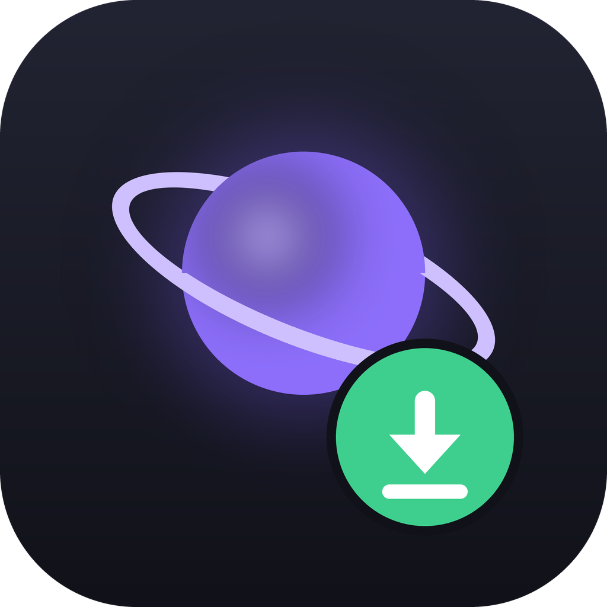
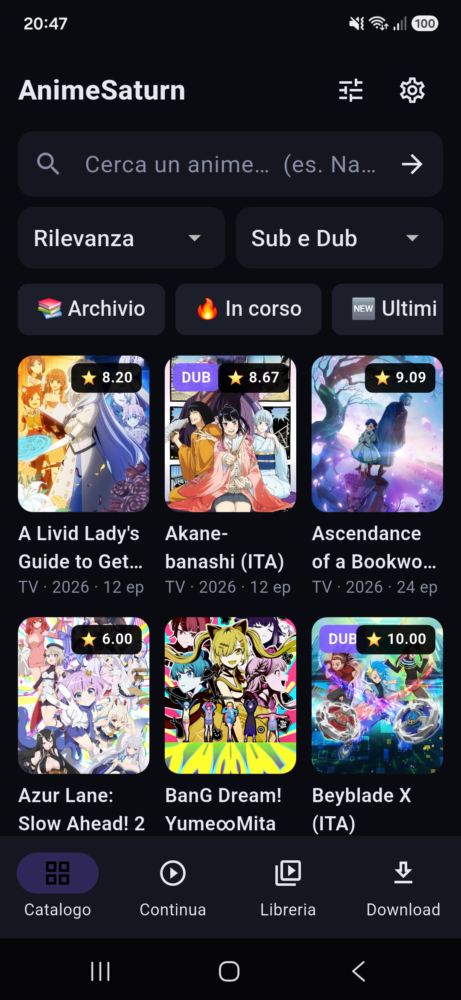
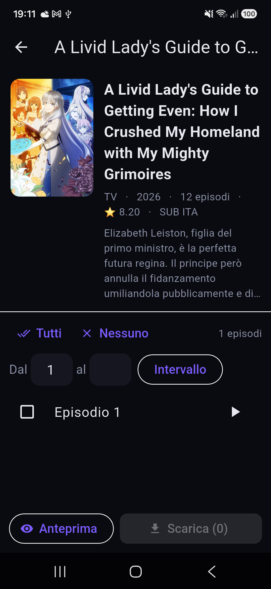
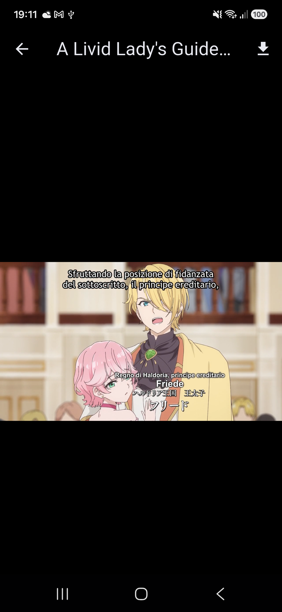

  

<h1 align="center">AnimeSaturn — App Android</h1>

  App <b>Android</b> per cercare, <b>guardare in streaming</b> e <b>scaricare</b> anime da
  <a href="https://www.animesaturn.net">AnimeSaturn</a> — player integrato, download offline,
  "continua a guardare". Tutto in un'app, senza browser.

  

---

## 📸 Anteprima

  
  &nbsp;
  
  &nbsp;
  

## ✨ Funzioni

- 🔎 **Ricerca** con suggerimenti mentre scrivi, **catalogo** (Archivio / In corso / Ultimi) e
  **filtri avanzati** (genere, tipo, stato, stagione, lingua, anno, Sub/Dub).
- 📺 **Scheda anime** con trama e lista episodi; selezione singola, tutti o a intervallo.
- ▶️ **Player integrato**: streaming o file scaricati, **schermo intero** in orizzontale,
  **episodio successivo** e **auto-avanzamento** a fine puntata.
- ⏯️ **Continua a guardare**: riprende da dove eri rimasto (anche il minuto), streaming o offline.
- 📥 **Download** con coda, **velocità**, download simultanei regolabili, **ripresa** dopo
  un'interruzione e notifica di avanzamento.
- 📁 **Libreria offline** con player interno.
- 🌐 **Dominio automatico**: se AnimeSaturn cambia indirizzo, l'app trova da sola quello nuovo;
  altrimenti lo puoi cambiare dalle Impostazioni.

## ⬇️ Installazione

1. Vai alla pagina **[Releases](https://github.com/piciolo/Anime-saturn-Android/releases/latest)**
   e scarica **`AnimeSaturn-*-arm64-v8a.apk`** (va bene per praticamente tutti i telefoni
   moderni). Solo per telefoni molto vecchi a 32 bit usa la variante `armeabi-v7a`.
2. Apri l'APK sul telefono. Al primo avvio Android chiederà di consentire l'installazione da
   **origini sconosciute**: acconsenti e completa.
3. Apri l'app e buona visione. 🎬

> L'APK non è firmato da Google Play (distribuzione **sideload**): è normale che Android mostri
> un avviso di sicurezza per app installate fuori dallo Store.

## 📱 Requisiti

- Android **7.0** (API 24) o superiore.

## ⚠️ Note

Strumento pensato per **uso personale**. Rispetta le leggi sul diritto d'autore e i termini di
servizio del sito: guarda/scarica solo contenuti per cui hai i relativi diritti. Progetto non
ufficiale, non affiliato ad AnimeSaturn.
